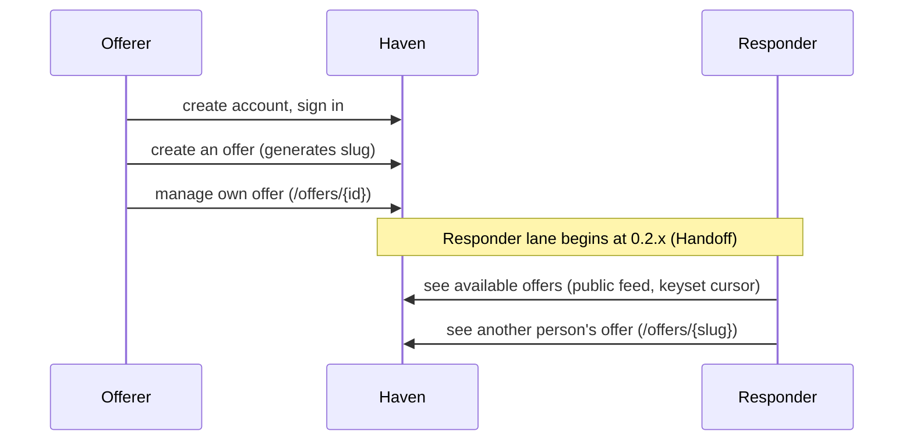

# Haven journey

One story, two lanes. Lanes are roles, not people: the **Offerer** (the person making an offer) and the **Responder** (the person responding to it). One person can play both. Stages follow `ROADMAP.md`; only the current stage is detailed.

Status: draft. Only entries under **Decided** were confirmed by the owner. Everything else is open or an observation from the code.

## The story at a glance

| Stage | Question | Offerer lane | Responder lane | Handoff | Status | Load target |
|---|---|---|---|---|---|---|
| 0.1.x | Can I offer something? | create account, sign in, create / see own / edit / delete an offer | none yet | none | completed | met historical baseline (see PERFORMANCE_CONTRACT.md) |
| 0.2.x | Can someone see it? | offer becomes public on create (generates slug); manage own via `/offers/{id}` | see available offers (public feed), see another person's offer (`/offers/{slug}`) | an offer becomes visible to others | current | ≥ 1,200 iters/s host direct (p95 ≤ 200ms, p99 ≤ 500ms) |
| 0.3.x | Can someone act on it? | know about expressed interest | express willingness to take on an offer | commitment | not reached | |
| 0.4.x | Can someone find it? | | find an offer by name, narrow by price | | not reached | |
| 0.5.x | Can I come back to what I care about? | | save an offer, follow a person, return to both | | not reached | |
| 0.6.x | Can I narrow it down? | | narrow by category, tags, saved, committed | | not reached | |
| 0.7.x to 0.9.x | TBD | | | | not reached | |
| 1.0.x | Can two people close an offer? | | | agreement, closing | not reached | |
| 1.x | TBD | | | | not reached | |
| 2.0.x | Can Haven handle a complete trade? | | | payment, fulfillment, completion | not reached | |

## Stage 0.2.x: Can someone see it?  (current)

### Untangled items

**A person can see available offers.**
- Anyone (unauthenticated guest, crawler, or authenticated user) visits the public offer feed without needing to sign in.
- Shows available offers in reverse chronological order (`created_at DESC, id DESC`).
- Uses keyset cursor pagination on `(created_at, id)` with a capped page size (default 20, max 50). Keyset paging prevents skipped or repeated rows as new offers are created.
- Queries execute in $O(1)$ query count (verified by automated query-count tests).
- Each row or card displays title, price (or "Free"), currency (if priced), shortened description, and links to its public view via `slug`.
- Visual presentation follows `haven-ui-design` (monochrome first, semantic design tokens, clean typographic hierarchy, Airbnb-inspired restraint).
- States:
  - Empty: "No offers available yet" with a calm explanation and a link to create an offer (if authenticated or guiding to sign in).
  - Typical: list of offer cards.
  - Many items / Paginated: clear "Next" (and "Previous") cursor controls that maintain position without page drift.
  - Long text: titles wrap cleanly, descriptions are clamped.
  - Loading / Slow response: server-rendered fast response; no layout shift.

**A person can see another person's offer.**
- Anyone requests `/offers/{slug}` (or the public slug path).
- Zero authentication required: public and SEO-friendly.
- Does NOT question ownership: even if visited by the creator, the public view is rendered without edit/delete controls.
- Displays full title, price, currency, complete description, and creation metadata.
- Owner controls (edit, delete) reside exclusively at `/offers/{id}` where ownership is verified.
- States:
  - Typical: clean, text-led presentation of the offer.
  - Not found: unknown slug yields an informative 404 page with a link back to available offers.
  - Long content: long descriptions (up to 2,000 characters) render with comfortable line length (45–75 characters).
  - Offer deleted: if deleted while being viewed, subsequent interactions or reloads cleanly yield 404.

## Stage 0.1.x: Can I offer something?  (completed)

### Untangled items

**A person can create an account and sign in.** Checked in the roadmap. Completed via Magic Link and Google OAuth with adaptive session cookies.

**A person can create an offer.**
- Offerer is signed in and opens the create form.
- Fields: title (3 to 100 characters), description (10 to 2000 characters), price in minor units (0 or more, required). Currency from a fixed list (NGN, USD, EUR, GBP, CAD, AUD, KES, GHS) is required only when price is greater than zero; for zero-price offers, it may be omitted or blank and defaults to NGN.
- Enforced at domain and DB constraints.

**A person can see their own offers.**
- Offerer sees a list of their own offers. In 0.2.x, this view is hardened with keyset pagination and styled using semantic tokens.

**A person can edit an offer.**
- Offerer opens `/offers/{id}/edit` and modifies any subset of fields. Patch semantics preserve unchanged values.

**A person can delete an offer.**
- Offerer deletes their own offer after confirmation.

### Decided

- 2026-10-08: Public view of an offer is accessed via unique URL `slug` (e.g. `/offers/{slug}`) without authentication or ownership checks (SEO-friendly).
- 2026-10-08: `/offers/{id}` (by UUID) is reserved for authenticated owner management and enforces ownership.
- 2026-10-08: Public and owner offer listings use keyset cursor pagination on `(created_at, id)` with a capped page size to eliminate skip/repeat anomalies.
- 2026-10-08: A query-count test enforces that listing offers executes in $O(1)$ queries to prevent N+1 regressions.
- 2026-10-08: Load-testing gate for 0.2.x is ≥ 1,200 iterations/sec executed directly on the host machine.
- 2026-10-08: All pages and components (including previously unstyled forms and views) will be styled following `haven-ui-design`: monochrome first, semantic design tokens, semantic HTML, and strict CSP adherence.
- 2026-10-08: A price of 0 means free, for now (owner: provisional wording, may change later). Displayed as "Free".
- 2026-10-08: On create, an empty price field is a validation error; a person must explicitly enter 0 for a free offer.
- 2026-10-08: In 0.1.x a person can list all of their own offers and create, edit, and delete them.
- 2026-10-08: In 0.1.x a person cannot list another person's offers or request a particular one. Requesting another person's offer behaves like requesting one that does not exist.
- 2026-10-08: On update, old values are preserved; only the person's edits are written.

### Open questions

**Blocking** (the stage's "Done when" or the next screen depends on these):
- Route separation: should public slug route be `/offers/{slug}` (with unified router handling resolving UUID to owner management and string slug to public view) or explicit `/offers/{slug}` alongside `/offers/manage/{id}`?
- Slug collision handling: how are slugs generated for identical titles (e.g., base slug + 6-character random alphanumeric suffix)?

**Non-blocking:**
- Default page size: default 20 items, max 50 items per page?
- Keyset cursor encoding: base64-encoded `(created_at, id)` or compound string format?
- Header navigation: how should public header differentiate between signed-in and guest states?

### Deferred dependencies

- What happens to an offer that someone has already committed to when its owner edits or deletes it. Belongs to 0.3.x. Current behaviour until then: not defined; no commitments exist in 0.2.x.
- Search by name, filtering by price or category. Belongs to 0.4.x and 0.6.x. Current behaviour: reverse chronological public feed only.

### Done when (from the roadmap)

An offer created by one person can be seen by another person, and the system meets its load-testing target.
