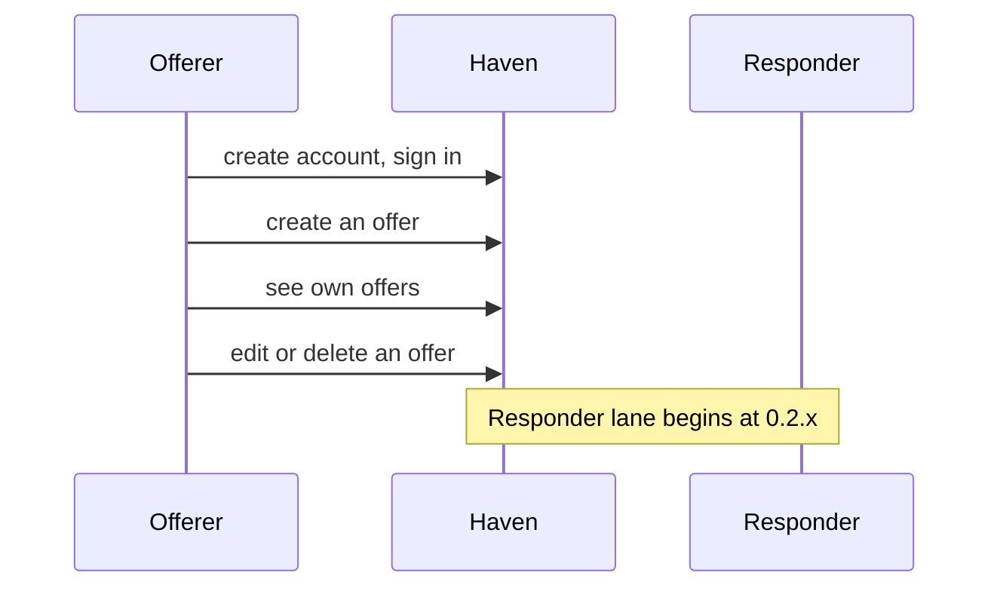

# Haven journey

One story, two lanes. Lanes are roles, not people: the **Offerer** (the person making an offer) and the **Responder** (the person responding to it). One person can play both. Stages follow `ROADMAP.md`; only the current stage is detailed.

Status: draft. Only entries under **Decided** were confirmed by the owner. Everything else is open or an observation from the code.

## The story at a glance

| Stage | Question | Offerer lane | Responder lane | Handoff | Status | Load target |
|---|---|---|---|---|---|---|
| 0.1.x | Can I offer something? | create account, sign in, create / see own / edit / delete an offer | none yet | none | current | not recorded here (see PERFORMANCE_CONTRACT.md) |
| 0.2.x | Can someone see it? | | see available offers, see another person's offer | an offer becomes visible to others | not reached | |
| 0.3.x | Can someone act on it? | know about expressed interest | express willingness to take on an offer | commitment | not reached | |
| 0.4.x | Can someone find it? | | find an offer by name, narrow by price | | not reached | |
| 0.5.x | Can I come back to what I care about? | | save an offer, follow a person, return to both | | not reached | |
| 0.6.x | Can I narrow it down? | | narrow by category, tags, saved, committed | | not reached | |
| 0.7.x to 0.9.x | TBD | | | | not reached | |
| 1.0.x | Can two people close an offer? | | | agreement, closing | not reached | |
| 1.x | TBD | | | | not reached | |
| 2.0.x | Can Haven handle a complete trade? | | | payment, fulfillment, completion | not reached | |

## Stage 0.1.x: Can I offer something?  (current)

### Untangled items

**A person can create an account and sign in.** Checked in the roadmap. Not re-untangled here.

**A person can create an offer.**
- Offerer is signed in and opens the create form.
- Fields (from the domain code, branch `feat/offer-constraints`): title (3 to 100 characters), description (10 to 2000 characters), price in minor units (0 or more, required). Currency from a fixed list (NGN, USD, EUR, GBP, CAD, AUD, KES, GHS) is required only when price is greater than zero; for zero-price offers, it may be omitted or blank and defaults to NGN.
- Person submits. Valid: the offer exists, owned by that person. Invalid: the form is shown again with the person's input kept and each problem shown next to its field.
- Edge states: person leaves midway, submits twice (refresh or double click), session ends while filling the form, price field left empty, price entered with decimals or separators.

**A person can see their own offers** (decided into 0.1.x, see below).
- Offerer sees a list of only their own offers and can open one.
- States: no offers yet, one, many.
- A row shows title, description (shortened), and price. No image, status, category, or tag exists yet.

**A person can edit an offer.**
- Offerer opens one of their own offers and changes any subset of title, description, price, currency.
- Only the changed fields are written; unchanged fields keep their stored values.
- Edge states: nothing changed, offer deleted in another tab, two tabs editing the same offer, session ends while editing.

**A person can delete an offer.**
- Offerer deletes one of their own offers after a confirmation that names it.
- Edge states: offer already gone, double submit.

### Decided

- 2026-10-08: A price of 0 means free, for now (owner: provisional wording, may change later). Displayed as "Free".
- 2026-10-08: On create, an empty price field is a validation error; a person must explicitly enter 0 for a free offer.
- 2026-10-08: In 0.1.x a person can list all of their own offers and create, edit, and delete them.
- 2026-10-08: In 0.1.x a person cannot list another person's offers or request a particular one. Requesting another person's offer behaves like requesting one that does not exist.
- 2026-10-08: On update, old values are preserved; only the person's edits are written.

### Open questions

**Blocking** (the stage's "Done when" or the next screen depends on these):
- What does delete mean: the offer is removed for good, or hidden but kept? Who can still see it? (The answer affects the data model.)
- Maximum price: price is a 32-bit number in minor units (about 21.4 million in a two-decimal currency). Is that enough for what Haven will carry?

**Non-blocking:**
- Are title and description trimmed before they are stored, or only validated trimmed?
- Do database constraints repeat the domain limits (length, price at least 0, currency in the list)?
- How is a price typed in major units (for example "4.50") turned into minor units exactly, and what happens with commas, extra decimals, or negative input?
- All listed currencies currently use two decimals. Adding one that does not must not pass silently.
- After creating, editing, or deleting an offer, where does the person land?

### Deferred dependencies

- What happens to an offer that someone has already committed to when its owner edits or deletes it. Belongs to 0.3.x. Current behaviour until then: not defined; no commitments exist in 0.1.x.
- Whether other people can see an offer, and how. Belongs to 0.2.x. Current behaviour: no one but the owner can see or request an offer.

### Done when (from the roadmap)

A person can create and manage an offer from beginning to end, and the system meets its load-testing target.
