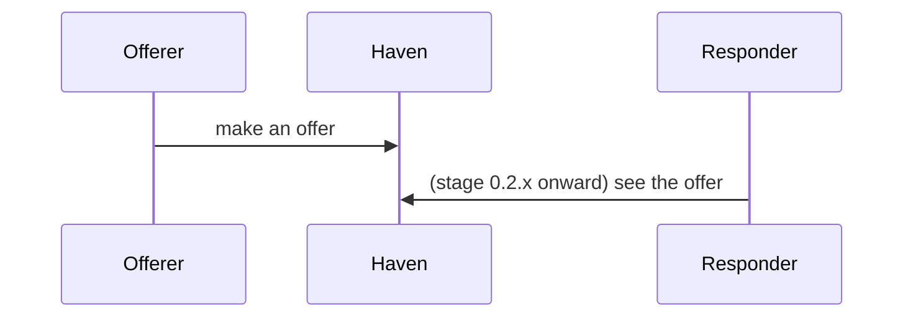

# Haven journey

## What this is

`docs/JOURNEY.md` is the whole journey permitted by the product, from first arrival to a completed trade, as **one continuous story**. It is not a feature list and not a route map. `ROADMAP.md` says which question each version answers; the journey says what a person is actually going through while that question is being answered.

**Two lanes, one story.** Lanes are *roles*, not people: the **Offerer** (the person making the offer) and the **Responder** (the person responding to it). One person can play both. The lanes run side by side, and the places where their paths meet (an offer being seen, interest expressed, commitment, agreement, payment) are called **handoffs** and are the most important part of the document.

## Core rules

1. **Go deeper, not wider.** While working on a stage, add depth to that stage only. A question that belongs to another stage is never answered early. It is recorded as a **deferred dependency** (below) and left alone.
2. **JIT: detail appears exactly when it is needed.** Future stages carry only what `ROADMAP.md` already says. Do not pre-detail them, do not guess their sub-steps, and do not fill TBD stages. Depth is added when work on a stage begins and removed from nobody; a deepened stage stays deepened.
3. **A checkbox is never atomic.** Each roadmap item abstracts a sub-journey. Untangle it (procedure below) before designing or building.
4. **The journey records product decisions; it does not make them.** Decisions are the user's. The agent proposes, the user decides, and only confirmed decisions are written as decided. Everything else is an open question.
5. **Derive from facts.** Sub-steps and states come from the roadmap's words and from the code and schema that currently exist, never from what a typical marketplace does. If analogous platforms are used as a reference, say which and why (and that it is a reference, not a decision).
6. **Journey first, then routes.** `docs/FLOWS.md` (via `haven-app-flows`) is the implementation layer underneath the stage currently being built. Do not describe routes in JOURNEY.md.

## Document shape

````markdown
# Haven journey

## The story at a glance

| Stage (roadmap) | Question | Offerer lane | Responder lane | Handoff | Status |
|---|---|---|---|---|---|
| 0.1.x | Can I offer something? | create account, sign in, create / edit / delete an offer | (none yet) | none | current |
| 0.2.x | Can someone see it? | sees own offers | sees available offers, sees one offer | offer becomes visible to others | not reached |
| ... one row per roadmap stage, using only the roadmap's words ... |

Status values: `not reached`, `current`, `answered`. Add the load-test gate state per stage (met / not met / not run) next to Status, from `PERFORMANCE_CONTRACT.md`.



## Stage 0.1.x: <question>  (current)

### Untangled items
For each roadmap checkbox of this stage:
- **<roadmap item>** expands to sub-steps per lane, the states involved, and the transitions between them.

### Decided
- <decision> (date; reason; who decided)

### Open questions
- **Blocking:** the stage's "Done when" cannot be met without an answer.
- **Non-blocking:** can be answered later within this stage.

### Deferred dependencies
- <question> belongs to <stage>; it surfaced here because <reason>; current-stage behaviour until then: <what the user decided, or "undecided">.

### Done when (from the roadmap)
<copied verbatim>, plus the load-test gate.
````

Stages that are `not reached` keep only their row in the glance table and nothing else.

## The untangle procedure (run at the start of work on a roadmap item)

1. Read `ROADMAP.md`, then `docs/JOURNEY.md` (create it from the template if missing, containing only roadmap-level rows).
2. Take one roadmap item. Write its **sub-journey for each lane that exists at this stage**: the person's goal, the steps, the states a thing can be in, what moves it between states, and what the person sees in each. In 0.1.x only the Offerer lane exists; the Responder lane starts when the roadmap introduces it.
3. For every step, ask three questions of the code and schema that exist today: what already exists for this, what is missing, what would break if this step went wrong or was repeated?
4. List the **edge states** inside the current stage (empty, partially filled, repeated action, failure midway, person leaves and returns).
5. Sort every unanswered question:
   - **Blocking** for this item's "Done when": ask the user before building.
   - **Non-blocking:** record as open; proceed only with the smallest assumption the user agrees to, written down as an assumption, not as a decision.
   - **Belongs to another stage:** record under *Deferred dependencies* with its owning stage. Do not answer it and do not design around it.
6. Present the untangled item to the user in short form: sub-steps, blocking questions, deferred dependencies. Wait for decisions.
7. Write confirmed decisions into *Decided*; leave everything else as open or assumed.

Example of the pattern (illustrative; do not copy as fact): "delete an offer" looks atomic, but hides what deleting means (removed, or hidden; who can still see it), and one question that belongs to a later stage: what happens to an offer someone has already committed to. The first is a 0.1.x blocking question. The second is a deferred dependency owned by 0.3.x.

## Keeping it true

- When code or schema changes what a person can do in the current stage, update JOURNEY.md in the same change.
- When a stage's "Done when" is met **and** its load-test gate passes, the user marks it `answered`; the agent proposes, never decides.
- When JOURNEY.md and the code disagree about what a person can do, report the mismatch and ask which is intended.
- If the journey reveals that a roadmap item is wrong or missing, propose the roadmap change to the user with evidence. Do not edit `ROADMAP.md` yourself.

## Checks before reporting done

- [ ] Only the current stage was deepened; no other stage gained detail.
- [ ] Every deferred question names its owning stage.
- [ ] Every "Decided" entry was confirmed by the user.
- [ ] Lane-specific steps are in the right lane; handoffs are marked where the lanes meet.
- [ ] Words match the roadmap (person, offer, commitment, interest); no invented synonyms.
- [ ] No route, handler, or table names in JOURNEY.md.
